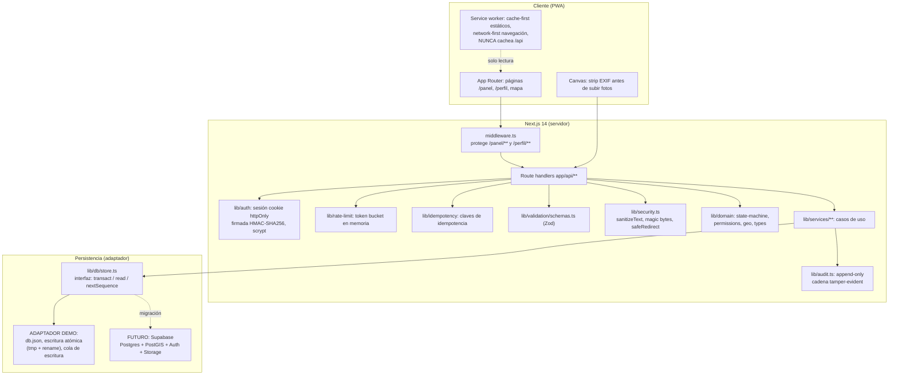

# FLM — Arquitectura

Stack: **Next.js 14 (App Router) + TypeScript estricto + Tailwind**, PWA con service worker, MapLibre GL JS para mapas. Sin ORM: la persistencia se accede a través de un **adaptador** con interfaz estable (`lib/db/store.ts`: `transact` / `read` / `nextSequence`).

## Diagrama

## Capas y responsabilidades

| Capa | Responsabilidad | Regla |
|---|---|---|
| `middleware.ts` | Redirigir a `/login?next=…` si no hay cookie de sesión en `/panel/**`, `/perfil/**` | Solo presencia de sesión; **no valida rol** (corre en Edge) |
| Route handlers (`app/api/**`) | Validar (Zod), autenticar (`requireAuth`), autorizar (`permissions.ts`), rate limit, idempotencia | Nunca confían en el cliente para transiciones |
| `lib/services/**` | Casos de uso: crear reporte, transicionar, verificar, moderar | Toda mutación sensible escribe en `audit` |
| `lib/domain/**` | Reglas puras: máquina de estados, matriz de permisos, geo | Sin I/O; testeable sin infraestructura |
| `lib/db/store.ts` | Interfaz de persistencia | El resto del código no conoce el JSON |

## Adaptador demo (hoy) vs ruta de migración (producción)

**Hoy — adaptador JSON** (`lib/db/store.ts`):
- Un archivo `db.json` (ruta en `FLM_DATA_DIR`, default `./.data`, ignorado por git).
- Escrituras atómicas (tmp + rename POSIX) y cola que serializa escrituras.
- Lecturas sin lock. Suficiente para demo de un solo proceso.

**Migración — Supabase** (sin cambiar el resto del código):
| Pieza demo | Reemplazo en producción |
|---|---|
| `db.json` + `transact`/`read` | Postgres vía Supabase; transacciones reales |
| `db.sessions` + cookie HMAC | Supabase Auth (el adaptador expone la misma interfaz de sesión) |
| `haversineMeters` (búsqueda por radio) | `ST_DWithin(geography, geography, metros)` con `geography(Point, 4326)` |
| `location`/`publicLocation` | Columnas `geography(Point, 4326)`; la aproximación se mantiene en el servicio |
| Fotos como dataURL | Supabase Storage con **URLs firmadas** de corta duración |
| Rate limit en memoria | Redis/Upstash (ver `lib/rate-limit.ts`) |
| `FLM_SESSION_SECRET` dev fallback | Secreto real obligatorio (`NODE_ENV=production` lo exige) |

Contrato que la migración debe mantener: tipos de `lib/domain/types.ts`, las 13 transiciones de `state-machine.ts` y la matriz de `permissions.ts`.

## Decisiones y desviaciones

- **Sin Supabase por falta de credenciales** → adaptador JSON con interfaz de migración documentada. Nunca se finge que el JSON es Supabase (ver `docs/DECISIONS.md`).
- **Fotos como dataURL en demo** → validadas con magic bytes en servidor (`lib/security.ts`); en producción van a Storage.
- **Sesiones propias en vez de Supabase Auth** → cookie httpOnly firmada HMAC-SHA256 + scrypt; revocables en el adaptador; expiración deslizante opt-in.
- **Sin Playwright** → los recorridos E2E se cubren a nivel servicios + handlers (ver `docs/TESTING.md`).
- **Middleware solo chequea presencia de sesión** → la autorización fina (rol, comuna) vive en cada página/API vía `permissions.ts`, porque el middleware corre en Edge sin acceso al store.
- `SESSION_COOKIE` se duplica en `middleware.ts` con comentario explícito: importar `lib/auth/auth.ts` ahí rompería el Edge runtime (`node:crypto`, `next/headers`).
