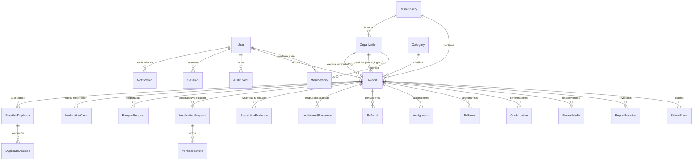

# FLM — Modelo de datos

Fuente de verdad en código: `lib/domain/types.ts`. El adaptador demo persiste colecciones como mapas `id → documento` en `db.json` (`lib/db/store.ts`).

## Entidades y relaciones

## Entidades principales

**User** — `id, email (normalizado, único lógico), passwordHash (scrypt), role, displayName, verifiedResident, createdAt`. El email se guarda en minúsculas y sin espacios; la unicidad se garantiza por búsqueda normalizada (`findUserByEmail`).

**Organization** — `id, kind (MUNICIPALITY | EXTERNAL_AGENCY | PLATFORM), name, shortName, verified, municipalityId`. Una municipalidad licenciada es una `Organization` kind `MUNICIPALITY`.

**Membership** — une `User` ↔ `Organization` con un `role` institucional. Un funcionario solo opera dentro de su comuna (ver `docs/PERMISSIONS.md`).

**Report** — el corazón del sistema:
- `id` (UUID interno), `code` (público, ej. `FLM-PUD-000123`, secuencial por comuna vía `nextSequence`),
- `municipalityId, categoryId, title, description` (**texto original inmutable**: nadie lo edita, ver regla de independencia),
- `location` (exacta, acceso restringido) y `publicLocation` (aproximada si la categoría es sensible),
- `state` (materializado; la historia real vive en `statusEvents`), `version` (concurrencia optimista),
- `authorId, anonymousPublic`, `responsibleOrgId / managingOrgId / executorOrgId`, `verifierId`,
- `confirmationsCount, followersCount`, timestamps.

**StatusEvent** — `{ reportId, from, to, actorId (null = sistema), reason, idempotencyKey, createdAt }`. Fuente histórica real del estado.

**VerificationVote / VerificationRequest** — votos ciudadanos sobre una solución informada; el quórum fijo (`lib/domain/verification.ts`) decide el paso a `VERIFIED_RESOLVED`, ejecutado por el actor interno `SYSTEM`. Peso siempre 1; un solo voto nunca resuelve.

**MunicipalAction** — `{ reportId, organizationId (kind MUNICIPALITY), actorId, type, publicDescription, evidenceRef, createdAt }`. Acción municipal acreditable: la única fuente del sello "Ya estuvo la Muni". Tipos: `EXTERNAL_COORDINATION_RECORDED`, `REFERRAL_ACCEPTED_BY_AGENCY`, `FIELD_WORK_RECORDED`, `CONTRACTOR_ACTION_RECORDED`, `SOLUTION_EVIDENCE_SUBMITTED`, `FOLLOW_UP_RECORDED`. Solo es causal si ocurrió antes o a la vez que se informó la solución.

**ModerationCase** — caso de moderación independiente con fundamento público obligatorio.

**AuditEvent** — append-only: `{ action, actorId, entityType, entityId, detail, createdAt }`. Nada se borra ni se edita.

**Session** — `{ id, userId, createdAt, expiresAt }`; el token es `id.firmaHMAC`. Tope de 10 sesiones activas por usuario.

**IdempotencyKey** — `{ statusCode, body, createdAt }` por clave UUID; evita duplicar mutaciones en reintentos.

## Nota PostGIS (migración)

En producción, `location` y `publicLocation` son columnas **`geography(Point, 4326)`**:
- La búsqueda por radio del adaptador demo (`haversineMeters` en `lib/domain/geo.ts`) se reemplaza por `ST_DWithin(ubicacion, punto, metros)`.
- La aproximación de coordenadas sensibles (`approximatePublicLocation`: grilla de ~150 m) se mantiene en la capa de servicio, no en la base: el dato exacto sigue existiendo con acceso restringido por rol y comuna.
- Índice espacial `GIST` sobre ambas columnas.
