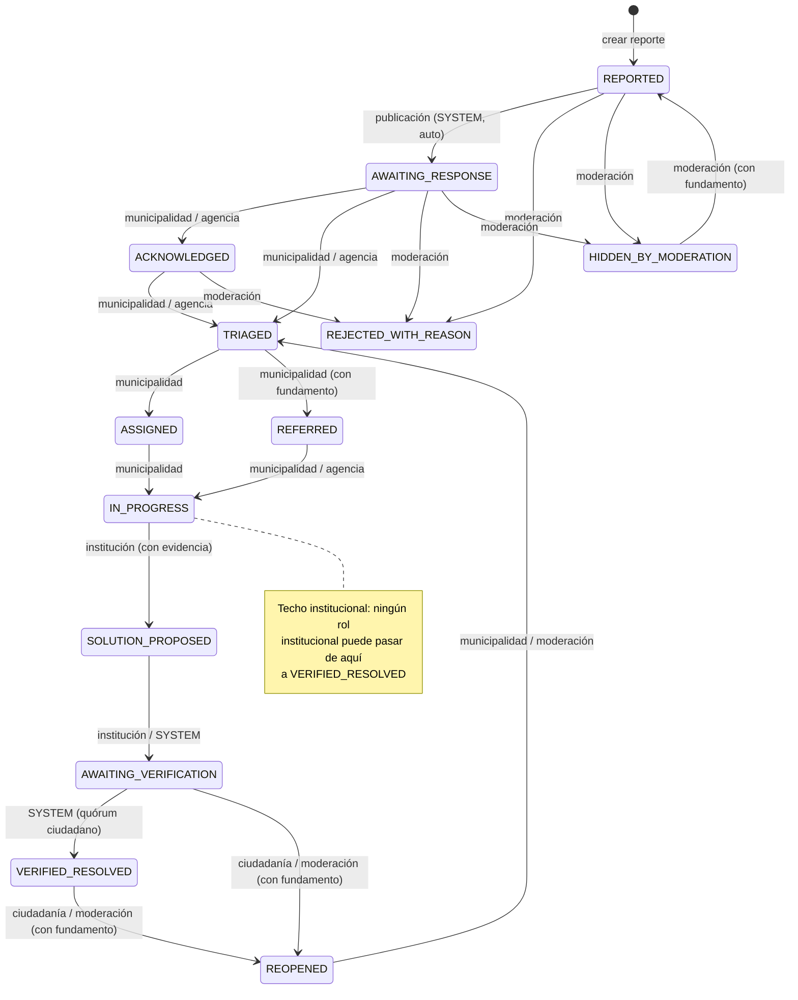

# FLM — Máquina de estados del reporte

Toda transición se valida **100% en servidor** (`lib/domain/state-machine.ts`, `assertTransition`). El cliente jamás decide transiciones. Las reglas de rol viven en la tabla `TRANSITIONS`; el alcance por comuna se chequea aparte en `permissions.ts`.

## Diagrama (13 estados)

## Tabla de transiciones y roles

| Desde → Hacia | Roles permitidos | Exige fundamento | Exige evidencia |
|---|---|---|---|
| REPORTED → AWAITING_RESPONSE | SYSTEM (automática al publicar) | No | No |
| AWAITING_RESPONSE → ACKNOWLEDGED | MUNICIPAL_AGENT, MUNICIPAL_MANAGER, EXTERNAL_AGENCY_AGENT | No | No |
| AWAITING_RESPONSE → TRIAGED | MUNICIPAL_AGENT, MUNICIPAL_MANAGER, EXTERNAL_AGENCY_AGENT | No | No |
| ACKNOWLEDGED → TRIAGED | MUNICIPAL_AGENT, MUNICIPAL_MANAGER, EXTERNAL_AGENCY_AGENT | No | No |
| TRIAGED → ASSIGNED | MUNICIPAL_AGENT, MUNICIPAL_MANAGER | No | No |
| TRIAGED → REFERRED | MUNICIPAL_AGENT, MUNICIPAL_MANAGER | **Sí** | No |
| ASSIGNED → IN_PROGRESS | MUNICIPAL_AGENT, MUNICIPAL_MANAGER | No | No |
| REFERRED → IN_PROGRESS | MUNICIPAL_AGENT, MUNICIPAL_MANAGER, EXTERNAL_AGENCY_AGENT | No | No |
| IN_PROGRESS → SOLUTION_PROPOSED | MUNICIPAL_AGENT, MUNICIPAL_MANAGER, EXTERNAL_AGENCY_AGENT | No | **Sí** (foto/documento) |
| SOLUTION_PROPOSED → AWAITING_VERIFICATION | MUNICIPAL_AGENT, MUNICIPAL_MANAGER, EXTERNAL_AGENCY_AGENT, SYSTEM | No | No |
| AWAITING_VERIFICATION → **VERIFIED_RESOLVED** | **SYSTEM** (actor interno, solo tras quórum ciudadano) | No | No |
| AWAITING_VERIFICATION → REOPENED | RESIDENT, VERIFIED_RESIDENT, INDEPENDENT_MODERATOR | **Sí** | No |
| VERIFIED_RESOLVED → REOPENED | RESIDENT, VERIFIED_RESIDENT, INDEPENDENT_MODERATOR | **Sí** | No |
| REOPENED → TRIAGED | MUNICIPAL_AGENT, MUNICIPAL_MANAGER, INDEPENDENT_MODERATOR | No | No |
| REPORTED / AWAITING_RESPONSE / ACKNOWLEDGED → REJECTED_WITH_REASON | INDEPENDENT_MODERATOR, PLATFORM_ADMIN | **Sí** | No |
| Cualquier estado no terminal → HIDDEN_BY_MODERATION | INDEPENDENT_MODERATOR, PLATFORM_ADMIN | **Sí** | No |
| HIDDEN_BY_MODERATION → REPORTED | INDEPENDENT_MODERATOR, PLATFORM_ADMIN | **Sí** | No |

## Regla "techo institucional" + "nadie verifica directo" (iteración 1)

**Ningún rol humano puede ejecutar la transición a `VERIFIED_RESOLVED`** — ni institucional (`MUNICIPAL_AGENT`, `MUNICIPAL_MANAGER`, `EXTERNAL_AGENCY_AGENT`), ni ciudadanía (`RESIDENT`, `VERIFIED_RESIDENT`), ni moderación independiente, ni `PLATFORM_ADMIN`.

La institución llega hasta `SOLUTION_PROPOSED` ("informamos la solución, con evidencia") y el sistema la mueve a `AWAITING_VERIFICATION`. Desde ahí, la ciudadanía vota: cuando se alcanza el quórum (ver `lib/domain/verification.ts` — vía A: autor + un vecino verificado; vía B: tres vecinos verificados), el **actor interno `SYSTEM`** ejecuta la transición dentro de la misma transacción del voto que completa el quórum. La ciudadanía puede reabrir el caso con fundamento si la solución no fue real.

Esto está codificado en `TRANSITIONS` (`lib/domain/state-machine.ts`) y reforzado en `transitionReport` (`lib/services/reports.ts`), que rechaza explícitamente cualquier intento HTTP de solicitar `VERIFIED_RESOLVED`, y en el esquema Zod, que ni siquiera acepta ese estado.

## Reglas transversales

- **Toda transición no listada es inválida** (`INVALID_TRANSITION`).
- **Concurrencia optimista**: el cliente envía `expectedVersion`; si el reporte cambió entremedio, la transición se rechaza (409).
- **Idempotencia**: `idempotencyKey` evita duplicar transiciones en reintentos de red.
- **Auditoría**: cada transición genera un `StatusEvent` y un `AuditEvent` con actor y timestamp.
- `REPORTED` pasa a `AWAITING_RESPONSE` automáticamente en la misma transacción de creación (decisión documentada en `docs/DECISIONS.md`).
